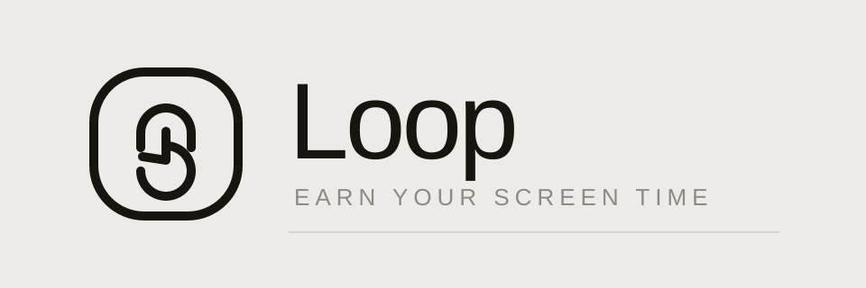

<p align="center">
  
</p>

<p align="center">
  <b>Loop is an iOS app that locks your most addictive apps until you earn them back with push-ups or squats, counted live by your camera.</b>
</p>

<p align="center">
  
  
  
  
</p>

---

## What it is

Instagram, TikTok, X, YouTube — the apps that quietly eat your day. Loop puts a lock in front of
them. To open one, you point your phone at yourself and do the reps. The camera watches your
joints, counts each clean rep, and only then does the lock come off.

No manual "I promise I did it" button. No timers you can dismiss. Just reps.

## How it works

1. **Pick your apps.** Choose which apps sit behind the lock.
2. **Pick your difficulty.** Easy, Medium, or Beast — this sets the reps required per unlock.
3. **Tap a locked app.** Loop intercepts with the unlock flow.
4. **Do the reps.** The front camera runs Apple's Vision body-pose model. `PoseEngine` tracks
   elbow angles for push-ups and knee angles for squats, and only counts a rep when you pass
   through the full range of motion — bottom, then lockout.
5. **You're in.** The app unlocks, your streak ticks up, and the reps land in your weekly stats.

## Features

- **Camera rep counting** — on-device `VNDetectHumanBodyPoseRequest` + AVFoundation. Nothing
  leaves your phone.
- **Two exercises** — push-ups and squats, each with joint-angle detection and coaching cues.
- **Three difficulties** — Easy, Medium, Beast, adjusting the rep cost of an unlock.
- **Streaks & stats** — daily streak, weekly rep bars, calories estimated per rep.
- **App locker** — toggle which apps are gated from Settings.
- **Warm-paper design system** — a deliberate monochrome look: bone background, near-black ink,
  hairline rules, medium-weight SF Pro Display, black pill buttons, thin line icons.

## Tech

| Area | Choice |
| --- | --- |
| UI | SwiftUI, `NavigationStack`, light mode only |
| State | A single `@Observable AppState`, `Codable`, persisted to `UserDefaults` |
| Pose detection | Vision `VNDetectHumanBodyPoseRequest` over an AVFoundation capture session |
| Rep logic | Joint-angle state machine in `PoseEngine.swift` |
| Design system | `Theme.swift` + `Components.swift` |

### Project layout

```
loopy/
├── loopyApp.swift        # App entry point
├── RootView.swift        # Splash → Onboarding → Auth → Main routing
├── SplashView.swift
├── OnboardingView.swift
├── AuthView.swift
├── MainView.swift        # NavigationStack shell
├── HomeView.swift        # Streak, weekly bars, stats, locked-app list
├── SettingsView.swift    # Locked apps, workout config, account
├── UnlockFlowView.swift  # lock → choose → workout → success
├── CameraPoseView.swift  # AVFoundation capture + Vision overlay
├── PoseEngine.swift      # Joint-angle rep counter
├── AppState.swift        # Observable app state + persistence
├── Models.swift          # ExerciseType, Difficulty, LockedApp, …
├── Theme.swift           # Palette + typography
└── Components.swift      # Buttons, cards, rules, pills
```

## Getting started

```bash
git clone https://github.com/ishan-crd/loopy.git
cd loopy
open loopy.xcodeproj
```

Then pick a simulator or your device and hit **⌘R**.

> The Xcode target uses a file-system-synchronized group — dropping a new `.swift` file into
> `loopy/` includes it automatically, no project file editing needed.

### Running on a simulator

Simulators have no camera, so the rep counter falls back to a **"Count a rep"** button. There are
also environment hooks for jumping straight to a screen:

```bash
SIMCTL_CHILD_LOOP_DEMO=1        # boot signed-in, straight into the main app
SIMCTL_CHILD_LOOP_UNLOCK=1      # open the unlock flow
SIMCTL_CHILD_LOOP_STEP=workout  # lock | choose | workout | success
SIMCTL_CHILD_LOOP_SETTINGS=1    # push Settings
```

## Privacy

The camera feed is processed entirely on-device by Vision. No frames, no landmarks, and no
workout data are uploaded anywhere.

## Status

Early build. Auth is mocked, and app locking is simulated inside Loop rather than enforced through
the system Screen Time / Family Controls APIs — that's the next milestone.

## License

MIT.
